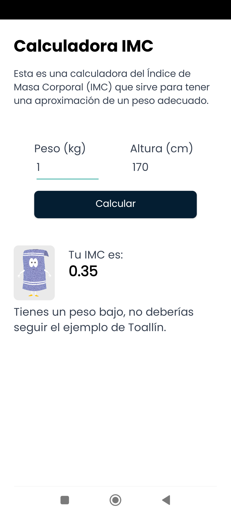

# App que calcula el IMC

Esta aplicación calcula el índice de masa corporal (IMC) de una persona. El IMC es una medida de asociación entre el peso y la talla de una persona. Se calcula dividiendo el peso de una persona en kilogramos por el cuadrado de su altura en metros.

## Preview

## Stack

- Java 1.8 & Android 28
- B4A

## Otros

- Modo vertical
- Resolución de pantalla mínima: 320x480
